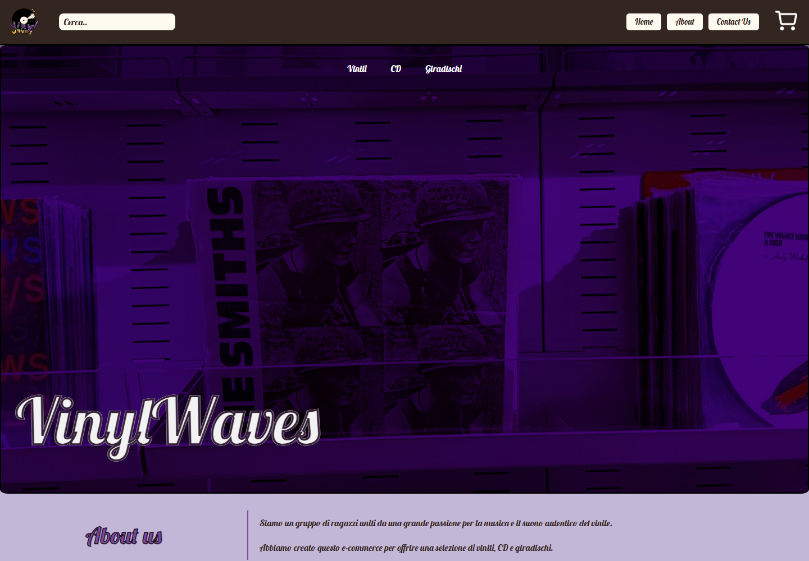
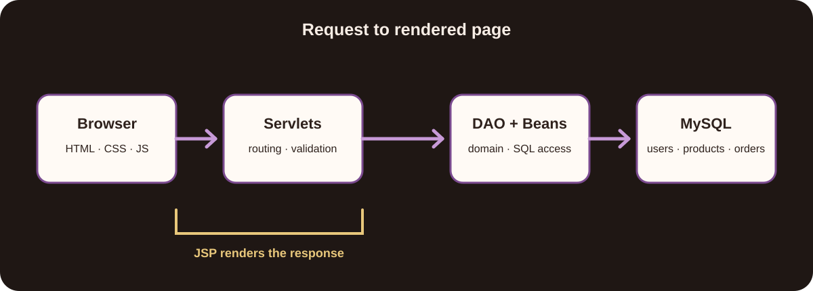

<p align="center"></p>

<h1 align="center">VinylWaves</h1>

<p align="center">Un e-commerce Java per vinili, CD e giradischi, sviluppato come progetto universitario di Tecnologie Software per il Web.</p>

<p align="center"><a href="README.md">English</a> · <b>Italiano</b></p>



## Il progetto

VinylWaves è stato realizzato da un gruppo di tre studenti per sviluppare un e-commerce lungo tutto lo stack Java server-rendered: catalogo, ricerca e filtri, account, carrello, checkout, storico ordini e gestione amministrativa di prodotti e ordini.

Il repository resta pubblico come testimonianza del lavoro svolto durante gli studi. Mostra il livello e le scelte del progetto originale: non viene presentato come un negozio pronto per la produzione né come un lavoro individuale.

## Flussi principali

- consultazione e filtro di vinili, CD e giradischi;
- dettaglio prodotto e ricerca nel catalogo;
- registrazione, accesso e modifica del profilo;
- carrello in sessione e completamento dell'ordine;
- storico degli ordini;
- gestione di prodotti e stato ordini tramite route separate per ruolo;
- validazione dei form nel browser e sul server.

## Architettura

L'applicazione segue una struttura Java web di tipo MVC. Le Jakarta Servlet ricevono le richieste, le JSP costruiscono la risposta, i JavaBean trasportano i dati di dominio e i DAO isolano l'accesso SQL a MySQL.



Lo schema del database è in `vnl_db.sql`. Credenziali e implementazione concreta di `DBManager.java` non sono versionate.

## Avvio locale

Il progetto originale usa Java 21, Maven, Jakarta Servlet 5 e MySQL. Importa `vnl_db.sql`, prepara la connessione locale attesa dal livello DAO e crea il WAR:

```sh
cd vnl
./mvnw package
```

Il WAR va distribuito su un container Jakarta compatibile, per esempio Tomcat 10. La cartella `target/` presente nel repository è un artefatto storico del progetto universitario; quando è disponibile la configurazione privata del database è preferibile una build pulita.

## Stack

Java 21 · Jakarta Servlet/JSP · Maven · MySQL · JDBC/DAO · HTML · CSS · JavaScript · JSON/XML

## Gruppo

- Ferdinando Gregorio Fernandez ([@Ferdinando980](https://github.com/Ferdinando980))
- Antonio Ceruso ([@Ceuto](https://github.com/Ceuto))
- Giulia Ferraro ([@g.ferraro34](https://github.com/g.ferraro34))

## Contesto accademico

Sviluppato per il corso di *Tecnologie Software per il Web*. Il README documenta il sistema e attribuisce il lavoro a tutti i componenti; il codice resta quello del progetto universitario, non una demo riscritta a posteriori.

## Licenza

Copyright © 2025 i contributori di VinylWaves. Tutti i diritti riservati. Il codice è visibile per valutazione accademica e professionale; riuso, redistribuzione e opere derivate non sono consentiti. Vedi [LICENSE](LICENSE).
